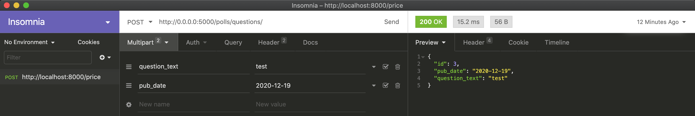

# Guía

Esta guía muestra un ejemplo de un contenedor que corre una app con `Flask` y otro que ejecuta un servidor de `PostgreSQL`, orquestados por medio de `Docker Compose`.

Parte de lo aprendido en el `ejemplo-9`, pero en esta ocasión, aparte de integrar `Flask` y `Docker Compose` el ejemplo muestra un ejemplo de como estructurar mejor una aplicación con archivos de configuración, inicialización y variables de ambiente en `Python`. De igual manera la app permite interactuar con ella por medio de los verbos `GET` y `POST` de `HTTP`, de tal manera que podamos ver la faceta `CRUD` de `Flask` en acción.

Al igual que el `ejemplo-9`, la app utiliza el `ORM` `Peewee` para conectarse a `PostgreSQL` y crear registros en ella, pero en esta ocasión `Peewee` se hace cargo de crear la tabla en la base de datos.

1. Ejecuta el comando `docker-compose up -d --build` y espera a que ambos contenedores estén listos
   1. Ambos contenedores deben de estar en ejecución. Puedes verificarlos individualmente utilizando `docker logs <nombre-del-container>`
2. Visita la URL <http://0.0.0.0:5000/polls/questions/>. Obtendrás un `JSON` vacío de inicio como respuesta
   1. Para poder crear registros en la DB es necesario hacer un `POST` request a esta URL. Puedes lograr esto por medio de CLI con clientes como [`cURL`](https://curl.se/), o bien, por medio de clientes con GUI como [`Postman`](https://www.postman.com/) o [`Insomnia`](https://insomnia.rest/). A continuación se adjunta una imágen de como ejecutar un `POST` request por medio de `Insomnia`, el funcionamiento es muy similar para `Postman`: 
   2. Vuelve a visitar la URL de <http://0.0.0.0:5000/polls/questions/>, y en esta ocasión deberías de poder ver un `JSON` con los registros que insertaste. Esto es meramente un `GET` request a través de tu navegador de internet, el cual funge como cliente :wink:
   3. Alternativamente puedes revisar los registros directamente en tu contenedor de `PostgreSQL`, para poder hacer esto sigue los pasos descritos a continuación:
      1. Ejecuta el comando `docker exec -it pollsdb bin/bash` para meterte al contenedor de `PostgreSQL`
      2. Una vez dentro ejecuta el cliente de CLI `psql` con el siguiente comando: `psql -U <db-user> -d peewee_polls`, donde `<db-user>` es el `POSTGRES_USER` que hayas configurado para este contenedor
      3. Una vez dentro de la DB, puedes utilizar el comando `\dt` para ver las tablas existentes en la base de datos, ahí deberías de ver la tabla de `question`. Puedes jugar con esta tabla utilizando los queries normales que conoces de `SQL`, intenta con `SELECT * FROM question;` por ejemplo y sin miedo, estos queries son casi iguales a otros motores de `SQL` a los que ya pudieras estar familiarizado, como `MySQL` o `MS SQLServer` por ejemplo :wink:
      4. Puedes salir del client `psql` utilizando el comando `\q`, y después salir del contenedor tecleando `exit`
3. Una vez que hayas terminado con todas las pruebas y las experimentaciones que querías llevar a cabo procede a detener todos los containers en ejecución utilizando el comando `docker-compose down -v --rmi all`. Este comando aparte de detener y remover los contenedores y las networks que se hayan creado, también borrará los volúmenes creados (flag `-v`) y las imágenes que se construyeron y/o descargaron (opción `--rmi all`) para echar a andar cada contenedor

## Recursos

* <https://docs.docker.com/compose/>
* <https://www.postgresql.org/>
* <https://hub.docker.com/_/postgres>
* <http://docs.peewee-orm.com/en/latest/>
* <https://flask.palletsprojects.com/en/1.1.x/>
* <https://developer.mozilla.org/es/docs/Web/HTTP/Methods/GET>
* <https://developer.mozilla.org/es/docs/Web/HTTP/Methods/POST>
