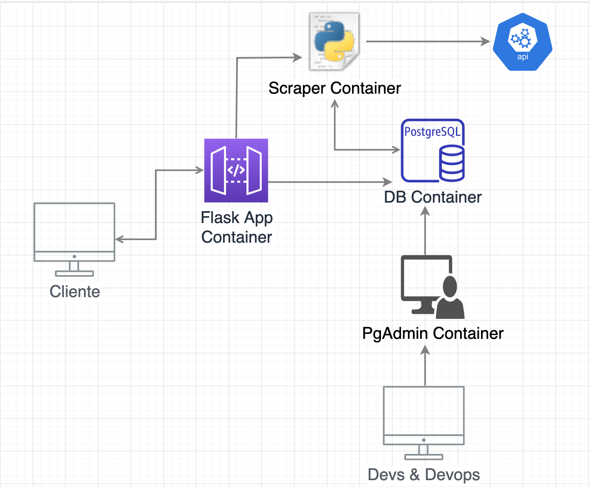

# Guía

Esta guía muestra un ejemplo de `Flask` y `Peewee` interactuando con una DB de `PostgreSQL` para guardar datos de una API pública (<https://aws.random.cat/meow>), los cuales podremos visualizar ya sea por medio de `PGAdmin` o directamente desde nuestro contenedor de `Flask`, todo orquestado por medio de Docker Compose.

El ejemplo combina lo visto en los ejemplos 9 y 10, junto con un poco de la lógica interna de la aplicación vista en el ejemplo 3, de tal manera que tengamos los siguientes 4 contenedores que complementen a toda la aplicación:

1. Un contenedor que maneja el frontend de la app y que utiliza `Flask`. Este interactua con el contenedor de la base de datos para obtener los registros guardados en la DB por medio del contenedor 2
2. Este contenedor corre un script de python que se conectará con la API de gatitos para obtener múltiples registros, almacenándolos en la base de datos
3. Este contenedor corre la base de datos en `PostgreSQL` e inicializa la única tabla que se utiliza en la DB por medio del archivo [init.sql](db/init.sql)
4. Ejecuta un servidor de `PgAdmin` que se conecta con la base de datos y que funge como DBMS de la aplicación

Se puede tomar el siguiente diagrama como referencia del funcionamiento de la aplicación:

Para ejecutar la aplicación basta con seguir los pasos descritos a continuación:

1. Ejecuta el comando `docker-compose up -d --build` y espera a que los contenedores estén listos
   1. Puedes verificar los contenedores en ejecución individualmente utilizando el comando `docker logs <nombre-del-container>`
   2. El contenedor 2 debería de estar arriba solamente por un tiempo en específico (el tiempo que tarde en "_crawlear_" la API pública) y después debería de detenerse
2. Visita la app por medio de la URL <http://0.0.0.0:5000/>. Puedes interactuar con los siguientes endpoints de la aplicación tanto por `GET` requests como por `POST` requests: `/hello` y `/my-cats`. Échale un vistazo al archivo [`app.py`](app/app.py) para mayor detalle :wink:
   1. Deberías de poder ver **10** gatos existentes en la DB por medio de la URL <http://0.0.0.0:5000/my-cats>. Estos fueron los que se crearon gracias al contenedor 2
   2. Recuerda que puedes utilizar clientes como `cURL`, `Postman` o `Insomnia` para llevar a cabo esta interacción :wink:
   3. Juega un poco con la aplicación y haz ajustes a diestra y siniestra. Si quisieras ver algún cambio en específico reflejado en la app en ejecución (por ejemplo en el frontend, o volver a correr el [`scraper`](app/scraper.py) pero con más registros) basta con aplicar los cambios a los archivos y reiniciar el contenedor que contiene esos archivos por medio del comando `docker restart <nombre-del-container>`. Podrás ver estos cambios reflejados sin tener que detener los demás contenedores y sobre todo sin tener que reconstruir todas las imágenes gracias a los [bind mounts de docker](https://docs.docker.com/storage/bind-mounts/)
3. Una vez que te sientas listo, recuerda utilizar `docker-compose down` para detener y borrar todos los contenedores en ejecución

## Recursos

* <https://docs.docker.com/compose/>
* <https://flask.palletsprojects.com/en/1.1.x/>
* <http://docs.peewee-orm.com/en/latest/index.html>
* <https://www.postgresql.org/>
* <https://hub.docker.com/_/postgres>
* <https://www.pgadmin.org/>
* <https://hub.docker.com/r/dpage/pgadmin4/>
* <https://pythonizando.com/consumir-una-api-rest-con-python-3-usando-requests/>
